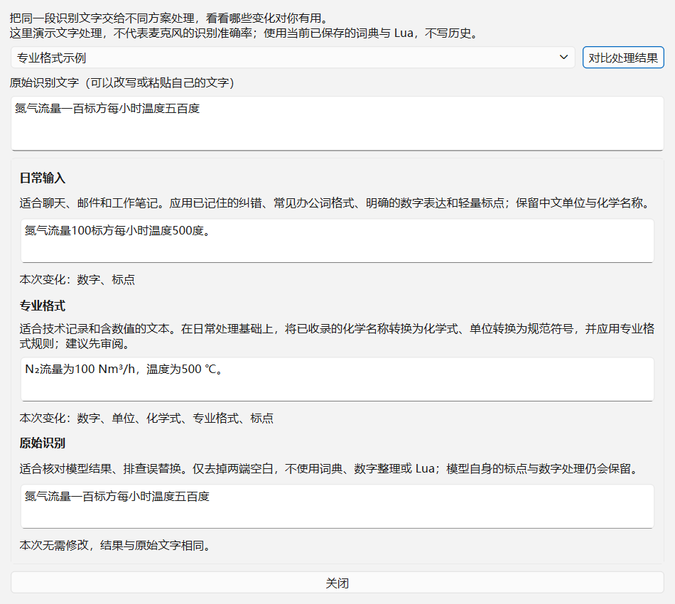
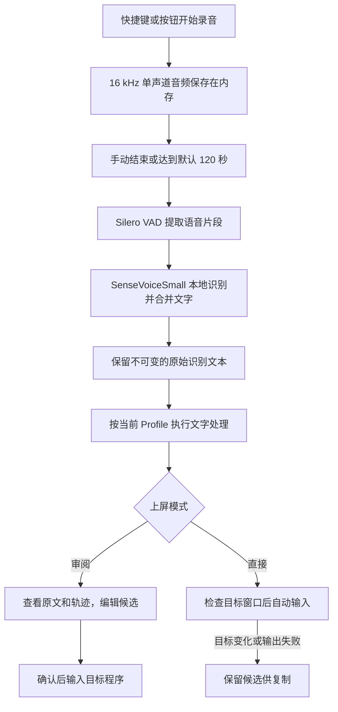
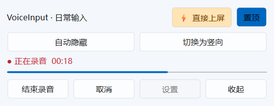
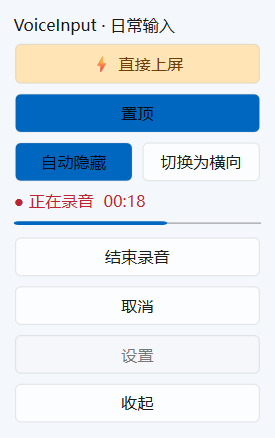

# VoiceInput

**Windows 离线语音输入工具：说出来，按用途整理，再输入到正在使用的软件。**

当前版本：**V0.2.1**，适用于 Windows 10/11 x64。

VoiceInput 使用本地 SenseVoiceSmall 模型识别语音，再通过词典、数字与单位规则、Lua 脚本整理文字。既可以检查候选后确认，也可以主动开启直接上屏。无需 API Key，模型安装完成后可离线使用。

适合聊天、邮件、工作笔记和技术记录。按一次快捷键开始，再按一次结束，默认每段最长 120 秒。当前不提供会议长录音、音频文件转写、说话人区分或大模型润色。

## 阅读导航

- [三种方案与处理示例](#三种方案与处理示例)
- [参考项目与实际依赖](#参考项目与实际依赖)
- [识别流程](#识别流程)
- [首次安装与开始使用](#首次安装与开始使用)
- [日常操作](#日常操作)
- [设置说明](#设置说明)
- [纠错学习与个人词典](#纠错学习与个人词典)
- [进阶配置与 Lua](#进阶配置与-lua)
- [模型与离线安装](#模型与离线安装)
- [数据与升级](#数据与升级)
- [常见问题](#常见问题)
- [源码开发与发布](#源码开发与发布)

## 三种方案与处理示例

**Profile 是文字处理方案，不是三个不同的语音模型。** 三种方案使用同一个模型，但对识别文字做不同整理。Profile 和“是否直接上屏”互相独立。

| 方案 | 适用场景 | 主要处理 |
|---|---|---|
| **日常输入** `normal` | 聊天、邮件、工作笔记，默认选择 | 已记住的纠错、常见办公词格式、明确的数字表达、轻量标点；保留中文单位和化学名称 |
| **专业格式** `science` | 技术记录、含数值和单位的文字 | 日常处理 + 收录的术语、化学式、单位符号、专业 Lua 规则；建议先审阅 |
| **原始识别** `raw` | 核对模型、排查误替换、保留原始表达 | 只清理两端空白，不应用词典、数字整理或用户 Lua |

### 同一句话，为什么还要进一步处理？

以下是将**固定文字送入默认处理链**得到的结果，展示规则的作用。实际口述时，模型可能已经输出数字或标点，不一定与示例逐字相同。

原始文字：`请连接WIFI，等待三分钟，进度百分之五十`

| 方案 | 输出 |
|---|---|
| 日常输入 | `请连接Wi-Fi，等待3分钟，进度50%。` |
| 专业格式 | `请连接Wi-Fi，等待3 min，进度50%。` |
| 原始识别 | `请连接WIFI，等待三分钟，进度百分之五十` |

原始文字：`氮气流量一百标方每小时温度五百度`

| 方案 | 输出 |
|---|---|
| 日常输入 | `氮气流量100标方每小时温度500度。` |
| 专业格式 | `N₂流量为100 Nm³/h，温度为500 ℃。` |
| 原始识别 | `氮气流量一百标方每小时温度五百度` |

另一个日常示例：`请把pdf文件和excel表格通过USB C复制` → `请把PDF文件和Excel表格通过USB-C复制。`

进一步处理能减少反复修改缩写、数字、单位和同一错词的操作。**这些是可查看、可修改的本地规则，不是语义润色**：不会理解整段意图、自动整理会议纪要，也不会可靠地删除口头禅。规则可能误替换，所以保留原文和轨迹很重要。

### 在程序里亲自比较

1. 打开“设置”，点击 **“三种方案对比（无需录音）”**。
2. 选择内置示例，或粘贴自己的识别文字，点击“对比处理结果”。
3. 查看各方案的输出及本次发生变化的环节。

窗口使用当前已保存的词典与脚本，调用实际处理链；不启动麦克风、不上屏、不写历史，也不会切换录音方案。修改输入后会清空旧结果，点击按钮重新计算。它演示文字处理，不代表语音识别准确率。



“原始识别”指模型输出。SenseVoice 自身开启了逆文本规范化（ITN），可能已经生成数字和标点；原始方案不会还原成逐字口语。

## 参考项目与实际依赖

这里区分选型／设计启发与实际运行依赖，方便了解项目来源。

| 项目 | 与 VoiceInput 的关系 |
|---|---|
| **DeepSeek Colony 的语音使用体验 / [DeepSeek Harness 的公开语音组件](https://github.com/deepseek-ai/deepseek-harness/blob/master/packages/experimental/speech-to-text-sensevoice/README.md)** | 语音选型参考。Harness 官方组件公开采用 SenseVoiceSmall ONNX + sherpa-onnx + Silero VAD，本程序采用同类模型与推理组合，通过 Python 实现独立 Windows 输入工具。“同一模型”指 SenseVoiceSmall 模型系列，不表示权重版本和参数完全一致。 |
| **[SenseVoice（原 FunAudioLLM，现 QwenAudio 仓库）](https://github.com/QwenAudio/SenseVoice)** | 实际使用的语音模型来源，本程序采用 SenseVoiceSmall INT8 ONNX。它不是 DeepSeek 开发的语音模型。 |
| **[sherpa-onnx](https://github.com/k2-fsa/sherpa-onnx)** | 实际调用的本地语音推理库，模型下载来自其[官方预训练模型说明](https://k2-fsa.github.io/sherpa/onnx/sense-voice/pretrained.html)。 |
| **[Silero VAD](https://github.com/snakers4/silero-vad)** | 实际使用的语音活动检测模型，通过 sherpa-onnx 调用，帮助分出有语音的片段。 |
| **[Rime](https://github.com/rime/home/wiki/RimeWithSchemata)** | 借鉴 YAML 方案配置、词典和处理组件分层的思路，以及 `processors / translators / filters` 的命名。本程序自行实现文字处理链，组件含义不与 Rime 完全相同。 |
| **[雾凇拼音（rime-ice）](https://github.com/iDvel/rime-ice)** | 借鉴按用途组织词库、区分默认配置与用户定制的方式。当前使用本项目的小型通用词典，没有直接打包雾凇词库或完整配置。 |

界面使用 PySide6，录音使用 sounddevice，配置使用 PyYAML，Lua 执行使用 Lupa，Windows 交互使用 pywin32 与系统接口。完整依赖见 [pyproject.toml](pyproject.toml)。

无需安装 DeepSeek Colony、DeepSeek Harness、Rime 或雾凇。VoiceInput 不调用 DeepSeek API，不读写 Rime userdb／LevelDB，可以与小狼毫、雾凇并存。参考关系不代表相关项目为本程序提供官方支持。

## 识别流程



默认处理顺序如下，各方案可以跳过部分步骤：

1. **方案选择**：决定启用的词典和过滤组件。
2. **用户纠错**：应用你明确“记住”的短词替换，并检查适用方案。
3. **术语词典**：整理办公词及当前方案启用的术语。
4. **数字处理**：处理百分数、范围、数量单位上下文等已实现规则。
5. **单位与化学式**：专业方案转换为 `℃`、`Nm³/h`、`N₂` 等。
6. **专业 Lua、轻量标点、用户 Lua**：按配置顺序执行，最后清理两端空白。

“查看处理”显示每一步的前后文字、规则和来源。词典作用于**识别之后的文字**，不是模型热词训练；学习纠错也不会重新训练模型。

录音时只显示状态、计时和音量，**结束后才识别**。VAD 用于识别阶段分段，不会因为暂时不说话而自动停止录音。

## 首次安装与开始使用

| 文件 | 用途 |
|---|---|
| `VoiceInput-V0.2.1-Windows-x64.zip` | 直接使用：解压后运行 `VoiceInput/VoiceInput.exe`，无需 Python |
| `VoiceInput-V0.2.1-source.zip` | 查看或修改代码：安装 Python 和依赖后运行，见文末 |

发布包不包含模型。保留整个解压目录，尤其是 EXE 同目录的 `runtime`，不能只复制 EXE。

1. **启动**：双击 EXE，出现控制条和系统托盘图标。已有旧版时，先在旧版托盘点“退出”。
2. **安装模型**：托盘选择“模型”→“开始下载 / 重试”，完成后关闭窗口。首次尝试录音也会提示安装。
3. **选麦克风**：设置中可选择设备或保留系统默认。确保 Windows 允许桌面应用访问麦克风。
4. **先用默认方案**：“日常输入”+“审阅后上屏”。在记事本等输入框放好光标。
5. **开始**：按一次 `Ctrl+Alt+Space`，或点“开始录音”。红色状态、计时和音量条表示正在采集。
6. **结束**：再按一次快捷键，或点“结束录音”。等待识别；首次加载模型可能稍慢。
7. **检查**：编辑候选，必要时比较原文或点“查看处理”。
8. **上屏**：点“确认并上屏”或按 `Ctrl+Enter`；不需要则按 `Esc` 或点“取消”。

若标准输入没有进入目标软件，在设置中改用“剪贴板粘贴”后再测试。

## 日常操作

### 控制条和托盘

- **开始／结束录音**：按钮不抢输入焦点，目标以录音开始时的外部窗口为准。
- **状态反馈**：显示方案、上屏模式、计时、真实音量；识别时显示等待状态。
- **取消**：录音期间放弃本次音频；识别期间取消则丢弃结果，要等后台结束后才能再次录音。
- **置顶／拖动／收起**：拖动空白区域调整位置；收起后从托盘“显示控制条”恢复。
- **自动隐藏**：默认关闭，可在控制条或设置中开启。空闲且鼠标离开约 2.5 秒后缩为小标签，鼠标移入或点击即展开；有状态提示时延长至约 6 秒。录音、识别、审阅、上屏和模型操作期间不自动隐藏。小标签仍显示审阅／直接模式；完全手动收起后从托盘恢复。
- **横向／竖向**：点击“切换为竖向／横向”，或在设置中选择。方向与自动隐藏、置顶分别保存，重新启动仍生效。自动隐藏不会强制改变置顶设置。
- **当前 Profile**：托盘切换本次运行方案；要改变下次启动默认方案，在设置中保存。
- **最近识别**：展示最近 100 条，双击查看轨迹。
- **退出**：从托盘菜单退出。

横向控制条：



竖向控制条与自动隐藏标签：




### 候选框

| 操作 | 作用 |
|---|---|
| A− / A+ / 字号输入 | 调节 12～36 pt 并保存，不改变文字 |
| 置顶 | 候选置顶与控制条分别保存 |
| 复制候选 | 复制当前编辑内容，便于手动粘贴 |
| 使用原始识别 | 用原文替换编辑区，会放弃本次手动编辑 |
| 恢复处理结果 | 回到本次自动处理结果，会放弃本次手动编辑 |
| 查看处理 | 查看变化步骤及规则来源 |
| 学习纠错 | 确认短词替换后保存本机规则 |
| Enter / Ctrl+Enter / Esc | 换行 / 确认上屏 / 取消 |

### 直接上屏

在设置中选择“直接上屏”，或在空闲时点击控制条的模式按钮。直接模式仍使用当前 Profile 整理文字，完成后自动输入，省去候选确认。

录音开始时固定本次方案和上屏设置。请保持目标输入窗口不变；前台切换、目标失效或输出失败时，结果保留供复制，不自动反复发送。脚本报错转为审阅，空结果不输出。

直接上屏没有自动撤回，也不自动学习你的后续修改。刚修改规则时，建议先审阅几次再开启。

## 设置说明

从控制条或托盘进入“设置”，修改后点“保存”；“取消”不保存表单。

| 设置 | 默认值 / 选项 | 作用 |
|---|---|---|
| 录音快捷键 | `Ctrl+Alt+Space` | 支持修饰键与 Space 或 F1～F24，如 `Ctrl+Alt+F9`；冲突时更换 |
| 录音方式 | 按一次开始，再按一次结束 | 也可按住说话、松开结束；鼠标按钮始终可开始／结束 |
| 上屏模式 | 审阅后上屏 | 直接模式需主动选择 |
| 候选字体大小 | 18 pt，可选 12～36 | 候选框内也能调节并立即保存 |
| 候选窗口置顶 | 开启 | 与控制条分别设置 |
| 控制条置顶 | 开启 | 关闭后可能被遮挡，可用托盘恢复显示 |
| 控制条自动隐藏 | 关闭 | 空闲时收为小标签，移入展开；忙碌时保持完整显示 |
| 控制条方向 | 横向 | 可选竖向，也可在控制条上直接切换 |
| 提示音 | 开启 | 开始、结束和失败的短提示 |
| 默认模式 | 日常输入 | 下次启动使用的 Profile；下方显示用途，可打开对比窗口 |
| 麦克风 | 系统默认 | 多设备时可指定，设备变更后重新选择 |
| 兼容输出方式 | 标准输入（SendInput） | 不接收标准输入的软件可改为剪贴板粘贴 |
| 已有模型目录 | 留空 | 留空使用程序管理的模型，也可选择离线模型目录 |

“审阅／直接”决定**什么时候输入**，“标准输入／剪贴板”决定**怎么输入**。专业方案不意味着直接上屏，原始方案也可以先审阅。

## 纠错学习与个人词典

### 记住常见错词

例如 `树据分析` 应改成 `数据分析`：在候选中改字→“学习纠错”→检查识别词和正确词→“记住”。“仅本次”不保存长期规则。保存后仍需“确认并上屏”才会输入目标程序。

程序只尝试推断单处短替换，不学习整段改写。规则修正再次出现的同一文本，不能保证模型以后总识别正确。原词需 2～24 字，目标需 1～24 字。界面保存的规则只作用于当时 Profile；原始方案默认跳过纠错，即使保存也不应用。

需要删除或修改规则时，编辑用户目录 `dictionaries/user.yaml`。有冲突或损坏时程序不会直接覆盖，保存前会备份旧文件。

### 增加术语词典

在设置底部找到实际用户目录，默认 `%LOCALAPPDATA%\VoiceInput`，可在资源管理器地址栏输入。新建 `dictionaries/project.yaml`：

```yaml
terms:
  - id: project_name
    spoken: [星河助守, 星河助首]
    output: 星河助手
    profiles: [normal, science]
```

再在用户目录 `config/user.custom.yaml` 启用它：

```yaml
profiles:
  normal:
    dictionaries: [common, project]
  science:
    dictionaries: [common, science, chemistry, units, project]
```

`spoken` 是可能出现的识别文字，`output` 是希望的写法；`profiles` 限制生效范围，省略则不按方案限制。文件名去掉 `.yaml` 就是词典名称。`units.yaml` 当前预留为空，主要单位规则在 Python 中实现。

用户纠错先于术语词典。同一阶段优先匹配长词，不将刚替换的结果在同一阶段再次替换；后续步骤仍可继续处理。词条是字面匹配，建议用明确完整词组，避免宽泛的短词。

## 进阶配置与 Lua

普通使用无需编辑 YAML。编辑时使用**用户目录**中的文件，不要修改发布包 `runtime` 的模板。YAML 用空格缩进，不用 Tab。配置与词典约一秒检查一次，忙碌时推迟生效；格式错误保留上次有效配置并提示。

### 用户覆盖

`config/user.custom.yaml` 优先于默认配置。映射按键合并，**列表整项替换**。例如改用专业方案、审阅模式、22 pt 字体及新快捷键：

```yaml
profile:
  default: science
output:
  mode: review          # review：审阅；direct：直接上屏
candidate:
  font_size: 22
hotkey:
  push_to_talk: Ctrl+Alt+F9
  mode: toggle         # toggle：按一次切换；hold：按住说话
toolbar:
  always_on_top: true
  auto_hide: false
  orientation: horizontal   # horizontal：横向；vertical：竖向
```

已有同名字段时合并内容，不要重复写顶层键。设置窗口也更新这个文件。旧版 `candidate.require_confirmation` 已由 `output.mode` 替代。

### 自定义 Profile

默认方案在 `config/profiles.yaml`，建议通过 `user.custom.yaml` 覆盖。例如保留专业单位，但不替换中文化学名称：

```yaml
profiles:
  science:
    disabled: [chemistry_normalizer]
```

| 字段 | 用途 |
|---|---|
| `label` | 显示名称；内部 ID `normal/science/raw` 保持不变 |
| `description` | 设置、候选及对比窗口的用途说明 |
| `example` | 对比窗口可选择的原始文字示例 |
| `dictionaries` | 术语词典列表，用户纠错由独立组件加载 |
| `disabled` | 排除的组件 |
| `only` | 只允许这些组件；若同时在 disabled 中仍被排除 |

新增方案键会出现在托盘和设置中。全局顺序由 `engine.processors / translators / filters` 控制。原始方案的 `only` 默认只有 `profile_processor` 和 `final_cleanup`，主动加入 `correction_dictionary` 后就不是纯原文。

Rime／雾凇 YAML 与本程序**不兼容，不能整份复制**。可从 `custom_phrase.txt` 等文件手动挑选词语，把误识别写法和正确词整理为这里的词条；无需拼音编码、词频或用户数据库。

### 用户 Lua

`lua/user/custom.lua` 默认原样返回。下面只在专业方案替换明确词组：

```lua
function filter(ctx)
  if ctx.profile == "science" then
    ctx.text = ctx.text:gsub("测试专用旧词", "测试专用新词")
  end
  return ctx
end
```

`ctx` 提供 `text`、`raw_text`、`profile`、`app_name`、`language`、`metadata`、`trace` 和只读 `config`。修改 `text` 后返回 `ctx`；原始文本不会被覆盖。可添加轨迹说明，`app_name` 和 `language` 可能为空。

保存脚本后下次处理加载。语法错误提示并尽量沿用上次有效版本，执行错误保留该步骤前的文字。默认日常和专业方案执行用户脚本，原始方案跳过。沙箱仅提供受限基础库，无文件、系统命令和网络访问，并限制内存及指令数；仍应只使用可信脚本。

## 模型与离线安装

当前为 **SenseVoiceSmall INT8 + Silero VAD**，地址在 `config/models.yaml`，使用本机 CPU、2 个推理线程。模型支持中文、英文、粤语、日语、韩语；本项目后处理主要面向中文，不保证方言、噪声和专业词的识别效果。

- **在线**：托盘“模型”下载，显示进度，可取消重试。保留未完成分片，服务器支持 Range 时续传。
- **离线**：准备同目录的 `model.int8.onnx`、`tokens.txt`、`silero_vad.onnx`，在设置中选择该目录。文件需匹配，不能把 FP32 改名冒充 INT8。
- **容量**：SenseVoice 权重约 230 MB，另有运行库及 VAD。压缩下载量、解压文件量和运行内存是不同概念。
- **校验**：安装检查压缩包及文件，实际加载后保存本地 SHA-256，后续检测损坏；本地摘要不是发布者签名。

来源许可见 [SenseVoice](https://github.com/QwenAudio/SenseVoice)（Apache-2.0）、[Silero VAD](https://github.com/snakers4/silero-vad)（MIT）及 [sherpa-onnx 模型说明](https://k2-fsa.github.io/sherpa/onnx/sense-voice/pretrained.html)。模型不随源码或 Windows 包分发。

## 数据与升级

下列位置相对于用户目录（默认 `%LOCALAPPDATA%\VoiceInput`）：

| 位置 | 内容 |
|---|---|
| `config/user.custom.yaml` | 设置窗口保存的选项和手动覆盖 |
| `config/profiles.yaml` | 本机方案定义 |
| `dictionaries/user.yaml` | 用户确认的纠错 |
| `dictionaries/*.yaml` | 内置和自定义术语 |
| `lua/user/custom.lua` | 用户脚本 |
| `models/sensevoice-small-int8/` | 模型 |
| `data/history.sqlite3` | 原始、处理后、最终编辑文字，窗口标题、方案、轨迹及是否发送 |
| `logs/app.log` | 轮转错误日志，默认不记录完整识别文本 |

**音频仅在内存处理，不保存录音文件；文字会保存到本机历史。** 界面显示最近 100 条，不表示数据库只有 100 条。当前没有自动清理设置；要清空，退出程序后删除 `data/history.sqlite3`，下次启动重建。

联网仅用于用户发起的模型下载，不上传语音或文本。上屏后的文字由目标软件按其规则处理。可用 `VOICEINPUT_HOME` 环境变量指定独立数据目录，设置底部显示实际位置。

升级时先退出旧版，再解压运行新版，保留完整 `runtime`。继续使用既有用户目录，通常不用重新下载模型。同一用户目录只允许一个实例。

V0.2.1 只自动升级**仍与旧版出厂定义一致**的三种 Profile，并保留 `config/profiles.pre-0.2.1.yaml.bak`。自行修改的方案保留原样，`user.custom.yaml` 仍优先。未自动升级时可参考本文手动添加说明、示例和 `common` 词典。已学习的纠错不会删除。

备份个人设置可保存用户目录；公开分享时不要把用户目录一起上传。

## 常见问题

**有音量但识别不准？** 先看原文，区分模型听错还是后处理误改。检查麦克风、距离和噪声；固定错词可学习纠错，规则误改可调整词典或禁用组件。对比窗口不重新识别音频。

**不想把“氮气”改成 N₂，或把“分钟”改成 min？** 使用日常方案，或关闭专业方案相应组件。单位转换是规则匹配，没有完整的语义消歧能力。

**没有实时字幕，停顿后也不结束？** 当前结束录音后识别，需再次按键或点结束；默认 120 秒上限自动结束。会议模式暂未实现，不建议仅调大时长替代会议功能。

**快捷键没反应？** 检查旧版是否仍在运行、组合键是否被占用，可换键或用按钮。无音量时检查设备选择及 Windows 麦克风权限。

**目标没有收到文字？** 检查光标，再改用剪贴板兼容方式。SendInput 成功只表示系统接受按键，不证明目标应用已写入。普通权限可能无法输入管理员窗口。失败时可复制候选，部分发送后不会自动重试。

**剪贴板会丢失吗？** 兼容输出暂存文字，粘贴后尝试恢复原 MIME 数据及图像；被其他软件修改则保留新内容并提示。复杂私有格式不保证完整保留。“复制候选”则明确覆盖剪贴板内容。

**如何退出和卸载？** 托盘点“退出”后删除解压的程序目录。若不再需要模型、历史和个人词典，再删除设置页显示的用户目录；这会删除个人数据。

## 源码开发与发布

Python 3.12+，建议 Windows x64 Python 3.13，在源码根目录运行：

```powershell
py -3 -m venv .venv
.venv\Scripts\python.exe -m pip install -e ".[dev]"
.venv\Scripts\python.exe -m voiceinput
.venv\Scripts\python.exe -m pytest -q
.venv\Scripts\python.exe -m voiceinput --smoke-test
.venv\Scripts\python.exe -m voiceinput --preview "氮气流量一百标方每小时温度五百度"
powershell -ExecutionPolicy Bypass -File scripts\package.ps1
.venv\Scripts\python.exe scripts\export_source.py
```

`--preview` 是不连接输出的候选预览，不依赖录音或模型。`--smoke-test` 使用程序用户目录，可指定独立 `VOICEINPUT_HOME` 避免与运行实例冲突。`scripts/verify_runtime.py --download --microphone` 是显式下载与一秒麦克风诊断，不保存音频。

`src/voiceinput/` 下：`app` 管理状态与托盘，`audio/asr` 采集识别和安装模型，`engine/lua` 执行处理链，`feedback/history` 负责纠错及历史，`ui/output` 负责界面及 Windows 输出。根目录 `config/dictionaries/templates` 是默认资源和干净模板。

版本变化见 [CHANGELOG](CHANGELOG.md)，本次验证见 [V0.2.1 验证记录](docs/V0.2.1_VALIDATION.md)。

源码导出使用公共文件白名单，排除本机配置、个人纠错和脚本、历史、日志、模型、虚拟环境、私有备份。Windows 包同样不含个人运行数据。程序从 `templates/` 初始化空白用户文件。

GitHub 仓库用于源码，Windows ZIP 可放在 Release。公开分发时保留根目录 `LICENSE`、`THIRD_PARTY_NOTICES.md` 和 `LICENSES/`；第三方组件继续适用各自许可。脚本不会自动创建仓库、推送或发布。

## 许可证

VoiceInput 自有源代码采用 [MIT License](LICENSE)，允许使用、修改、分发和商业使用，但须保留版权及许可声明，且软件不提供担保。

第三方库、Qt/PySide6、推理运行库以及用户另行下载的模型继续适用各自许可证，不因本项目采用 MIT 而改变。具体组件、版本、许可及 Qt 动态链接说明见 [THIRD_PARTY_NOTICES.md](THIRD_PARTY_NOTICES.md)。Windows 发布包同时携带 GNU GPL v3 和 LGPL v3 正文。
